# 🎭 Selenium Java to Playwright TS Converter

A powerful, intelligent tool to modernize your test automation stack. Convert legacy **Selenium Java** code into clean, idiomatic **Playwright TypeScript** using the power of local LLMs.


## ✨ Features

- **🧠 Intelligent Conversion**: Uses local LLMs (Ollama + Llama 3.2) to understand intent, not just syntax.
- **🎨 Premium UI**: A beautiful, glassmorphic React interface for a seamless developer experience.
- **⚡ Instant Feedback**: Real-time logging and error reporting from the conversion engine.
- **🛡️ Privacy First**: All code processing happens locally on your machine. No cloud data leaks.

## 🏗️ Architecture

The system follows the **B.L.A.S.T.** protocol and uses a clean 3-layer architecture:

```mermaid
graph TD
    subgraph Frontend [🎨 User Interface]
        UI[React + Vite App]
        style UI fill:#6366f1,stroke:#fff,stroke-width:2px,color:#fff
    end

    subgraph Backend [⚙️ API Server]
        API[FastAPI Server]
        Engine[Conversion Engine]
        style API fill:#a855f7,stroke:#fff,stroke-width:2px,color:#fff
        style Engine fill:#ec4899,stroke:#fff,stroke-width:2px,color:#fff
    end

    subgraph AI [🧠 Intelligence]
        Ollama[Ollama Local LLM]
        Model[Llama 3.2:3b]
        style Ollama fill:#0f172a,stroke:#fff,stroke-width:2px,color:#fff
        style Model fill:#0f172a,stroke:#6366f1,stroke-width:1px,color:#fff
    end

    UI --"POST /convert"--> API
    API --> Engine
    Engine --"Prompt"--> Ollama
    Ollama --"Inference"--> Model
    Model --"Generated Code"--> Ollama
    Ollama --"Response"--> Engine
    Engine --> API
    API --> UI
```



## 🚀 Getting Started

### Prerequisites

1.  **Node.js** (v18+)
2.  **Python** (v3.10+)
3.  **Ollama** (Running locally)
    ```bash
    # Install Ollama from ollama.com
    ollama serve
    ollama pull llama3.2:3b
    ```

### Installation

1.  **Clone the repository**
    ```bash
    git clone https://github.com/srinivaskinik/SeleniumJavaToPlayWrightJS.git
    cd SeleniumJavaToPlayWrightJS
    ```

2.  **Setup Backend**
    ```bash
    cd backend
    pip install -r requirements.txt
    python main.py
    # Server running at http://localhost:8000
    ```

3.  **Setup Frontend** (Open a new terminal)
    ```bash
    cd frontend
    npm install
    npm run dev
    # UI running at http://localhost:5173
    ```

## 💡 Usage

1.  Open the web interface at `http://localhost:5173`.
2.  Paste your **Selenium Java** code into the left panel.
3.  Click the **"Convert Logic"** button.
4.  View the modern **Playwright TypeScript** code in the right panel!

---

## 🤝 Contributing

Contributions are welcome! Please read `task_plan.md` to understand the roadmap and current progress.
